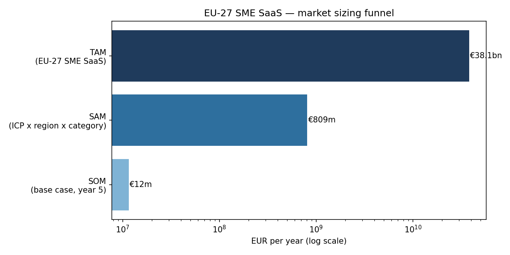
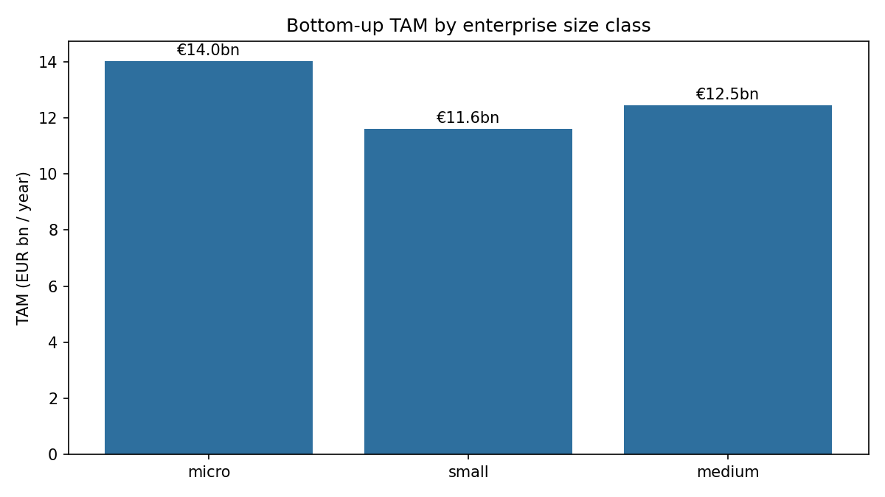
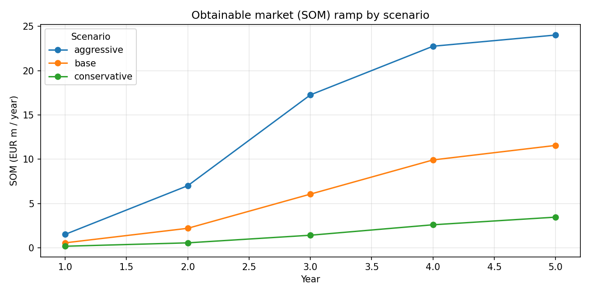
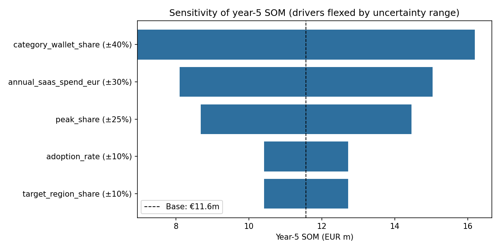
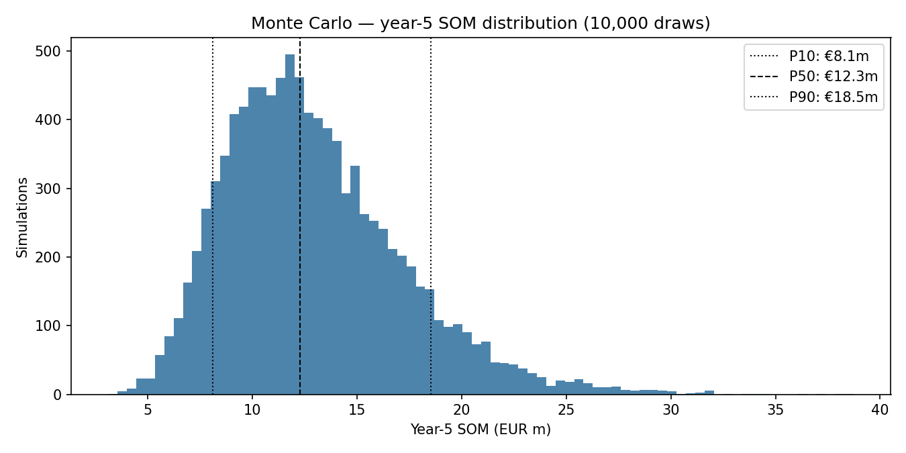
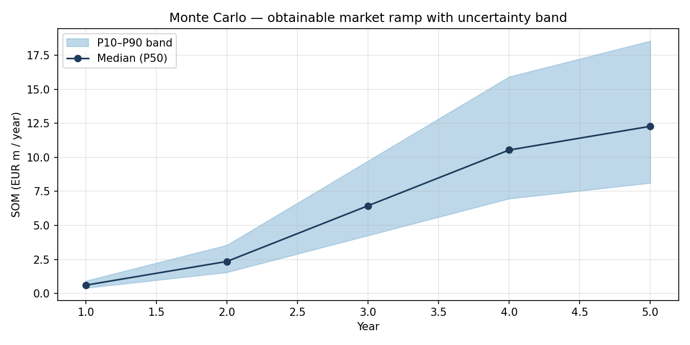

# EU-27 SME SaaS — Market Sizing Model (TAM / SAM / SOM)

A coded, auditable market-sizing model of the kind consulting teams usually build in
Excel — with three things Excel can't do: a **live data pipeline** pulling inputs
directly from the Eurostat API, a **10,000-draw Monte Carlo simulation** turning point
estimates into confidence bands, and a **test suite** guarding the funnel logic.
Bottom-up TAM by enterprise size class, top-down cross-validation, SAM filters for a
defined ICP, scenario-based SOM ramps, tornado sensitivity — all driven from a single
assumptions file and served through an interactive Streamlit app.

**Use case:** how large is the obtainable market for a hypothetical
productivity/workflow SaaS targeting European SMEs (10–249 employees) in
DACH + Benelux + Nordics?

## Why code instead of a spreadsheet

Firm counts and cloud-adoption rates come live from the Eurostat API (`sbs_sc_ovw`,
`isoc_cicce_use`) via [`src/eurostat_data.py`](src/eurostat_data.py), with a committed
cache for reproducible offline runs — re-run with `--refresh` and the whole model
updates when Eurostat publishes new data. Uncertainty is quantified rather than
ignored: a vectorised Monte Carlo ([`src/monte_carlo.py`](src/monte_carlo.py))
propagates driver distributions through the funnel, so the answer is "P10 €8m – P90
€19m", not a single false-precision number. Every input lives in
[`config/assumptions.yaml`](config/assumptions.yaml) with its source in a comment,
making the model versioned, auditable, and diff-able. Unit tests enforce that the
funnel narrows, scenarios stay ordered, Monte Carlo results reproduce exactly under a
fixed seed, and the bottom-up TAM stays within tolerance of the top-down cross-check.

## Methodology

```
TAM  = Σ (firms × paid-SaaS adoption × annual SaaS spend)   per size class
SAM  = TAM[ICP: 10–249 employees] × region share × category wallet share
SOM  = SAM × market share, logistic (S-curve) ramp per scenario, 5-year horizon
MC   = 10,000 draws over all uncertain drivers → P10/P50/P90 bands on SOM
```

Distributions are matched to evidence quality: Eurostat observations get tight
truncated normals, spend benchmarks get lognormals (right-skewed), and pure analyst
assumptions get wide triangular ranges.

The bottom-up TAM is triangulated against a top-down estimate
(European SaaS market × assumed SME share of spend). Base case lands within
~5% of the cross-check.

### Key inputs and sources

| Input | Value | Source |
|---|---|---|
| EU-27 firms — micro / small / medium | 31.19m / 1.57m / 0.25m | **Live from Eurostat API** ([sbs_sc_ovw](https://ec.europa.eu/eurostat/databrowser/view/sbs_sc_ovw/default/table?lang=en), 2023) |
| Paid cloud adoption — small / medium | 49.3% / 66.8% | **Live from Eurostat API** ([isoc_cicce_use](https://ec.europa.eu/eurostat/databrowser/view/isoc_cicce_use/default/table?lang=en), 2025) |
| European SaaS market (cross-check) | ~$92.7bn (2025) | GMI / Statista Market Insights |
| Annual SaaS spend per adopting firm | €1.5k / €15k / €75k | Analyst assumption triangulated from Cledara 2025 Software Spend Report, Vertice & Zylo SMB benchmarks |
| Micro-firm adoption rate | 30% | Analyst assumption (Eurostat ICT surveys cover 10+ employees only) |

All assumptions are explicit and flexed in the sensitivity analysis.

### Headline results (base case)

The bottom-up TAM comes to roughly €38bn/yr of total EU-27 SME SaaS spend, landing
within ~1% of the top-down cross-check. After the ICP, region, and category filters,
the SAM is about €0.8bn/yr. The deterministic base case puts the obtainable market
(SOM) at €11–12m/yr by year 5, and the Monte Carlo widens that to a P10 of €8.1m and
a P90 of €18.5m across 10,000 draws, with a 74% probability of exceeding €10m/yr.
The biggest swing factor is category wallet share — the least-evidenced assumption
dominates the tornado, which is exactly where further desk research would be pointed
on a real engagement.

## Key visuals








Run the model to regenerate exact figures — they are computed, not hard-coded.

## Project structure

```
├── app.py                 # Streamlit app (interactive assumptions, MC, charts)
├── run_analysis.py        # CLI: summary, CSVs + PNG figures (--refresh / --offline)
├── config/assumptions.yaml# All inputs, each with a source or explicit assumption
├── data/eurostat_cache.json # Committed API snapshot (reproducible offline runs)
├── src/
│   ├── assumptions.py     # YAML loading + validation (fail fast on bad inputs)
│   ├── eurostat_data.py   # Live Eurostat API pipeline + cache
│   ├── sizing.py          # TAM/SAM/SOM engine
│   ├── monte_carlo.py     # 10k-draw simulation, percentile bands
│   ├── sensitivity.py     # One-way sensitivity (tornado)
│   └── charts.py          # Static matplotlib figures
├── tests/test_sizing.py   # Funnel logic, pipeline, and MC reproducibility tests
└── outputs/               # Generated CSVs and figures
```

## How to run

```bash
pip install -r requirements.txt

# CLI: summary + figures into outputs/ (uses committed Eurostat snapshot)
python run_analysis.py

# Re-fetch inputs live from the Eurostat API
python run_analysis.py --refresh

# Interactive app
streamlit run app.py

# Tests
pytest
```

## Tools

Python, pandas, NumPy, requests (Eurostat API), Matplotlib, Plotly, Streamlit, PyYAML, pytest.

## Limitations

- Eurostat cloud-adoption statistics exclude micro-enterprises (<10 employees);
  the micro segment relies on a documented assumption.
- "Paid cloud services" (Eurostat) is a proxy for SaaS adoption — it includes IaaS/PaaS.
- Spend-per-firm benchmarks skew toward US/UK samples; EU SME spend may be lower.
- Static market snapshot: no market growth applied over the SOM horizon (conservative).
